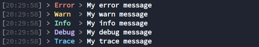

# loggify

[![conduct-badge][]][conduct]
[![release-badge][]][crate]
[![docs-badge][]][docs]
[![license-badge][]](#license)

[conduct-badge]: https://img.shields.io/badge/%E2%9D%A4-code%20of%20conduct-blue.svg?style=flat-square
[license-badge]: https://img.shields.io/badge/license-MIT-blue?style=flat-square
[release-badge]: https://img.shields.io/crates/v/loggify.svg?style=flat-square
[docs-badge]: https://img.shields.io/badge/docs-latest-blue.svg?style=flat-square
[conduct]: https://github.com/lholznagel/loggify/blob/master/CODE_OF_CONDUCT.md
[crate]: https://crates.io/crates/loggify
[docs]: https://docs.rs/loggify

A small and simple log implementation that I use in my rust projects.

## Install

Just add

``` toml
[dependencies]
log = "0.4.8"
loggify = "1.2.0"
```

to your `Cargo.toml`

## Usage

All examples can be found in the `examples` directory.

### Basic

The simpliest way is just to call `init`.
The default log level is `Info`, so that debug and trace messages are not shown.

``` rust
//! examples/01_basic.rs
//! # Basic usage for the logger
use log::{error, warn, info, debug, trace};
use loggify::Loggify;

/// The default level is INFO. So debug and trace outputs are oppressed
fn main() {
    Loggify::init().unwrap();

    error!("My error message");
    warn!("My warn message");
    info!("My info message");
    debug!("Will not be shown");
    trace!("Will not be shown");
}
```

### With log level

``` rust
//! examples/02_log_level.rs
//! Example for initializing the logger with a log level
use log::{error, warn, info, debug, trace, Level};
use loggify::Loggify;

/// Same as the basic example with the difference that
/// the logger is intialized with the debug log level.
fn main() {
    Loggify::init_with_level(Level::Debug).unwrap();

    error!("My error message");
    warn!("My warn message");
    info!("My info message");
    debug!("My debug message");
    trace!("Will not be shown");
}
```

### Log builder
``` rust
//! examples/03_builder.rs
//! Example for initializing the logger with the LogBuilder
use log::{error, warn, info, debug, trace};
use loggify::LogBuilder;

/// The `LogBuilder` is used to set more logger options
/// This example will change the log level to Trace
/// and the printed time format to time only
fn main() {
    LogBuilder::new()
        .set_level(log::Level::Trace)
        .set_time_format(String::from("%H:%M:%S"))
        .build()
        .unwrap();

    error!("My error message");
    warn!("My warn message");
    info!("My info message");
    debug!("My debug message");
    trace!("My trace message");
}
```

### Disabled color
``` rust
//! examples/05_builder.rs
//! Example for initializing the logger with the LogBuilder
use log::{error, warn, info, debug, trace};
use loggify::LogBuilder;

/// The `LogBuilder` is used to set more logger options
/// This example will disable the colored output
fn main() {
    LogBuilder::new()
        .disable_color()
        .build()
        .unwrap();

    error!("My error message");
    warn!("My warn message");
    info!("My info message");
    debug!("My debug message");
    trace!("My trace message");
}
```

### Exclude targets from log

``` rust
//! examples/04_exclude.rs
//! Example for excluding log targets from getting logged
use log::{error, warn, info, debug, trace};
use loggify::LogBuilder;

mod example {
    pub mod excluded {
        use log::info;

        pub fn call_me() {
            info!("I will not be logged");
        }
    }

    pub mod included {
        use log::info;

        pub fn call_me() {
            info!("I will be logged");
        }
    }
}

/// Exmple on how to exclude specific log targets
fn main() {
    LogBuilder::new()
        // this will show the log targets so that we can determine
        // what to exclude
        .set_log_target(true)
        // this will oppress all logs coming from example::excluded::*
        .add_exclude("example::excluded".to_string())
        .set_level(log::Level::Trace)
        .build()
        .unwrap();

    error!("My error message");
    warn!("My warn message");
    info!("My info message");
    debug!("My debug message");
    trace!("My trace message");

    // the log message of this call will not be shown
    example::excluded::call_me();
    // this log message will be shown
    example::included::call_me();
}
```

## Example output

[](./assets/terminal.png)